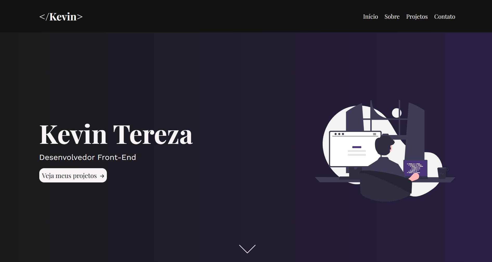

# 💼 Portfólio - Kevin Tereza

Meu portfólio pessoal desenvolvido do zero com **HTML**, **CSS** e **JavaScript**, apresentando meus principais projetos e informações sobre mim.  
O objetivo é demonstrar minhas habilidades em desenvolvimento **Front-End**, com foco em **interfaces modernas, responsivas e acessíveis**.

## 🚀 Tecnologias Utilizadas

-  **HTML5** → Estrutura semântica e acessível das páginas.
-  **CSS3** → Estilização responsiva.
-  **JavaScript** → Interatividade do menu mobile, comportamento dinâmico do site e manipulação do DOM.

## 🖼️ Demonstração



## 🔗 Link para o Deploy

[Acesse o projeto na Vercel](https://kevinterezadev.vercel.app/)

## 🔧 Rodar localmente

Caso queira visualizar ou modificar o código localmente:

1. **Clone o repositório:**

   ```bash
   git clone https://github.com/KevinTereza/portfolio.git
   ```

2. **Acesse o diretório do projeto:**

   ```bash
   cd portfolio
   ```

3. **Abra o arquivo `index.html` para visualizar o projeto.**

## 📄 Licença

Este é um projeto de estudo, criado com fins de aprendizado e portfólio pessoal, sem fins comerciais.
